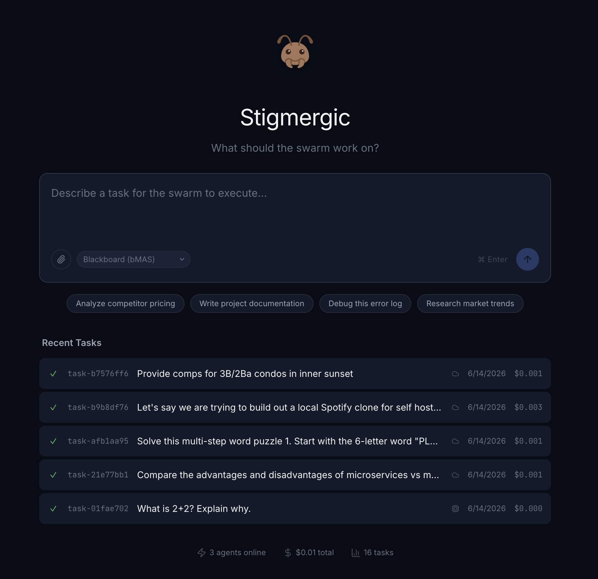
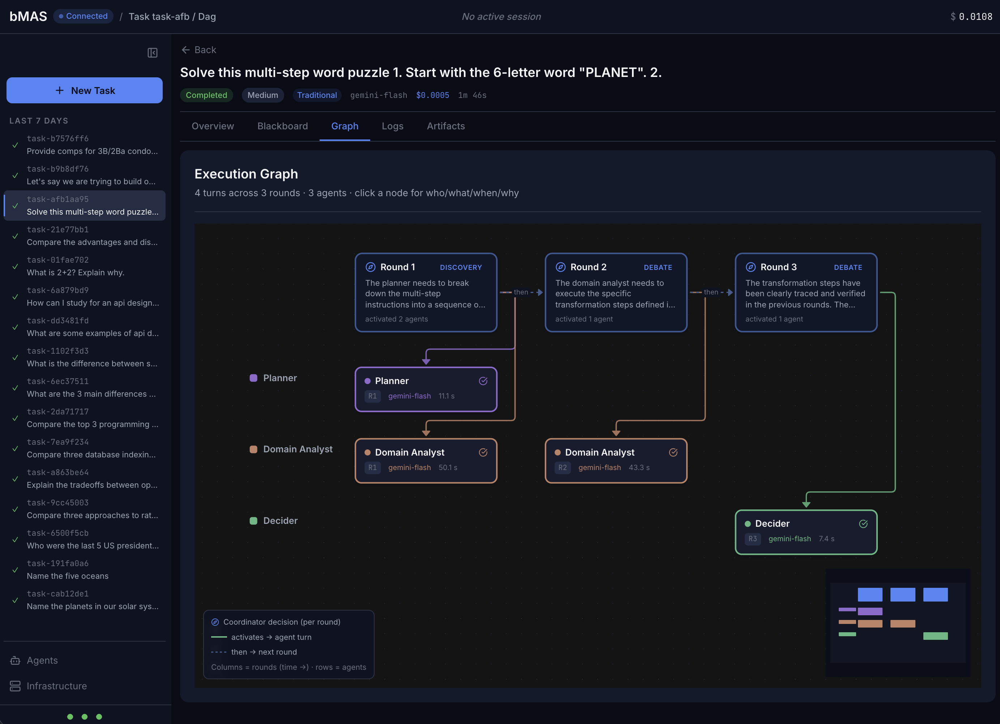
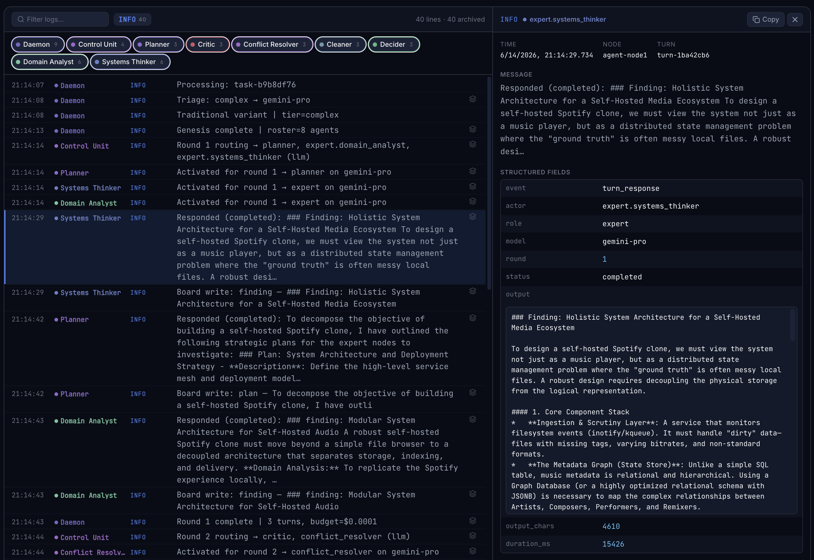
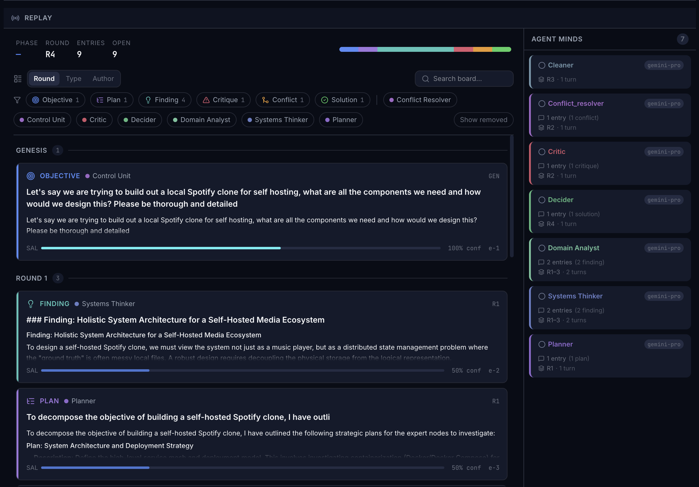
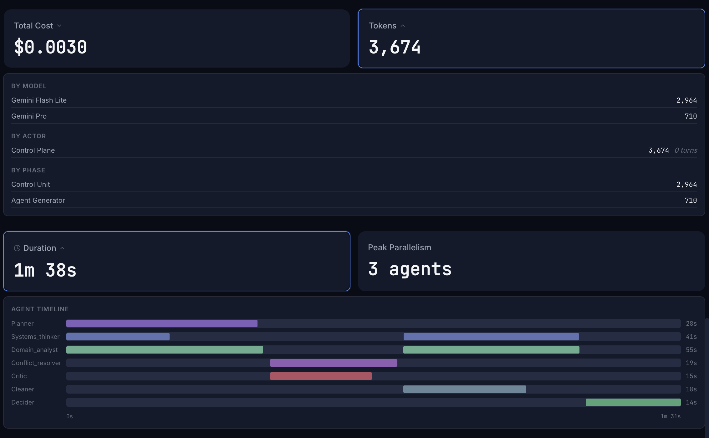

<p align="center">
  
</p>

<h1 align="center">Stigmergic</h1>

<p align="center">
  <strong>Blackboard Multi-Agent Swarm (bMAS) Orchestration System</strong>
</p>

<p align="center">
  <a href="#how-it-works">How It Works</a> •
  <a href="#see-it-in-action">See It In Action</a> •
  <a href="#quick-start">Quick Start</a> •
  <a href="#documentation">Documentation</a> •
  <a href="#components">Components</a>
</p>

<p align="center">
  <a href="LICENSE"></a>
  <a href="https://github.com/arvarik/bmas/actions/workflows/ci.yml"></a>
  <a href="https://python.org"></a>
  <a href="https://typescriptlang.org"></a>
  <a href="https://nextjs.org"></a>
  <a href="docker-compose.yml"></a>
</p>

---

**A distributed AI swarm built on the Blackboard Multi-Agent System (bMAS) architecture.** Stigmergic coordinates multiple LLM-powered agents through a shared blackboard with an LLM-driven Control Unit that dynamically selects agents per round and achieves structured, multi-round debate and consensus.

> *Named after [stigmergy](https://en.wikipedia.org/wiki/Stigmergy) — the mechanism by which individual agents coordinate through shared environmental signals (the blackboard) rather than direct communication.*

<p align="center">
  
</p>

## How It Works

**Orchestration** — A Control Unit reads the shared blackboard each round, selects which agents to activate, and those agents execute concurrently by writing findings, plans, and critiques back to the board. Rounds repeat until the swarm reaches consensus, hits a budget ceiling, or exhausts max rounds. Domain-specific experts are generated dynamically per task, not pre-configured.

**Observability** — Real-time execution graphs, distributed log streams across all agents, a blackboard command center, and per-model cost tracking are all visible in a live dashboard built with Next.js and Server-Sent Events.

**Operations** — Pause at round boundaries, inject directives, steer which agents run next, and set budget ceilings. A complexity classifier routes every task to the cheapest capable model before any paid API call — using Gemini Flash Lite by default (or a local Qwen3-1.7B model on GPU). One YAML file configures the entire deployment. Just `docker compose up` and you're running.

## See It In Action

### Execution Graph

Swimlane visualization showing agent turns grouped by round. Each node reveals what the agent did, why the Control Unit selected it, and what it cost.

<p align="center">
  
</p>

### Distributed Log Stream

Unified chronological log across all agents with per-role filtering. Click any entry to expand structured fields — actor, model, round, output, and duration.

<p align="center">
  
</p>

### Blackboard Command Center

The shared knowledge store. Timeline of board entries with salience heat, entry types, and debate threading. Agent Minds shows each agent's model and contribution count.

<p align="center">
  
</p>

### Cost & Performance

Per-model token breakdown, cost tracking, and an agent timeline showing when each role was active across rounds.

<p align="center">
  
</p>

## Quick Start

```bash
git clone https://github.com/arvarik/bmas.git
cd bmas

# Configure
cp bmas.example.yaml bmas.yaml    # edit with your IPs and settings
cp .env.example .env              # fill in secrets (API keys, passwords)

# Start
docker compose up -d              # without GPU
docker compose --profile gpu up -d  # with GPU (enables triage)

# Open Mission Control
open http://localhost:9321
```

See [Quick Start Guide](docs/QUICKSTART.md) for the full walkthrough.

## Documentation

| Document | Description |
|:---|:---|
| [Quick Start](docs/QUICKSTART.md) | Get running in 5 minutes |
| [Configuration](docs/CONFIGURATION.md) | Full `bmas.yaml` reference |
| [Architecture](docs/architecture/README.md) | System architecture & component deep-dive |
| [Node Setup](docs/NODE_SETUP.md) | Provisioning edge nodes with inference + agents |
| [Design System](docs/design/DESIGN.md) | Mission Control UI specification |
| [Hermes API](docs/HERMES_API.md) | Hermes Dashboard & Gateway API reference |

## Components

The project is organized into six deployable components, each with its own README:

| Component | Description |
|:---|:---|
| [`daemon/`](daemon/README.md) | **The brain.** Python FastAPI orchestrator — manages task lifecycle, cyclic blackboard execution, agent dispatch, and dual-write persistence (Redis + SQLite). |
| [`mission-control/`](mission-control/README.md) | **The eyes.** Next.js 16 real-time dashboard — execution graphs, distributed logs, blackboard command center, cost tracking, and HITL controls. |
| [`agent/`](agent/README.md) | **The hands.** FastAPI server deployed to each edge node — bridges the Daemon to Hermes agents via the Runs API with real-time trace and log shipping. |
| [`redis/`](redis/README.md) | **The shared memory.** Redis 8 serves as the blackboard — the central knowledge store through which all agents coordinate via Pub/Sub, Streams, and Redlock. |
| [`litellm/`](litellm/README.md) | **The router.** Unified OpenAI-compatible gateway that abstracts all model backends behind routing, cost tracking, and retry logic. |
| [`triage/`](triage/README.md) | **The gatekeeper.** Complexity classifier that routes tasks to the cheapest capable model — Gemini Flash Lite API by default (no GPU), or local Qwen3-1.7B on vLLM for zero-cost classification. |

Additional directories:

| Directory | Description |
|:---|:---|
| [`examples/`](examples/) | Sample configurations — multi-node homelab, minimal cloud, multi-provider routing |
| [`scripts/`](scripts/) | Operational utilities — CI checks, profile deployment, health checks |
| [`eval/`](eval/) | Evaluation harness — A/B testing, accuracy scoring, failure injection |
| [`docs/`](docs/) | All documentation — architecture, design system, guides |

## Papers

This project implements and extends multi-agent coordination architectures from published research:

> **Han, B. & Zhang, S. (2025).** *Exploring Advanced LLM Multi-Agent Systems Based on Blackboard Architecture.*
> [arXiv:2507.01701](https://arxiv.org/abs/2507.01701)

The foundational architecture. LLM agents coordinate through a shared blackboard with an LLM-driven control unit that dynamically selects agents per round — achieving competitive performance with state-of-the-art multi-agent systems while consuming fewer tokens. Stigmergic implements this as the **traditional** coordination variant.

> **Zhang, S., Shi, W. & Wang, H. (2026).** *PatchBoard: Schema-Grounded State Mutation for Reliable and Auditable LLM Multi-Agent Collaboration.*
> [arXiv:2605.29313](https://arxiv.org/abs/2605.29313)

A complementary coordination paradigm where agents emit validated JSON-Patch mutations against a schema-grounded state tree through a deterministic kernel — achieving 84.6% task success (vs. 30.8% for LangGraph) with zero committed-state contamination under fault injection. Stigmergic implements this as the **PatchBoard** coordination variant.

## License

This project is licensed under the [GNU Affero General Public License v3.0](LICENSE).
