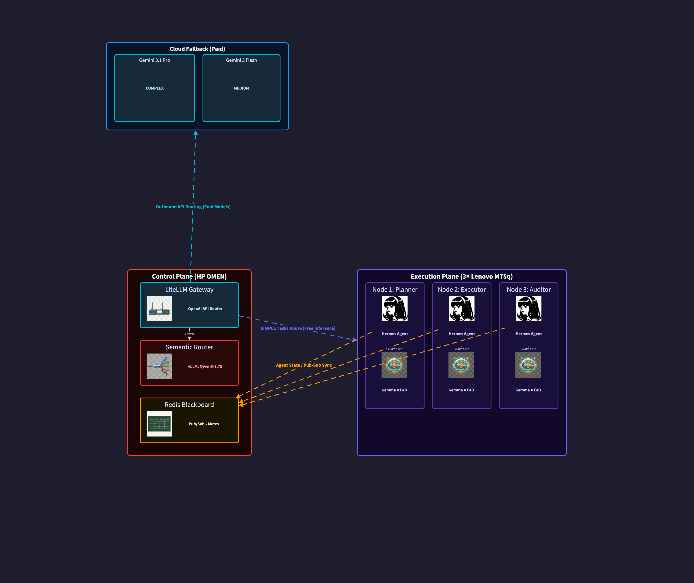

# Stigmergic

[](LICENSE)
[](https://python.org)
[](https://typescriptlang.org)
[](https://nextjs.org)
[](docker-compose.yml)
[](redis/)
[](litellm/)
[](triage/)

**A distributed AI swarm built on the Blackboard Multi-Agent System (bMAS) architecture.** Stigmergic coordinates multiple LLM-powered agents to decompose, execute, and audit complex tasks through a structured debate-and-consensus workflow.

> *Named after [stigmergy](https://en.wikipedia.org/wiki/Stigmergy) — the mechanism by which individual agents coordinate through shared environmental signals (the blackboard) rather than direct communication.*

## Features

- **Multi-agent orchestration** — Planner → Executor → Auditor pipeline with DAG-based task decomposition
- **Multi-provider routing** — Route tasks to Gemini, Claude, OpenAI, or local models based on complexity
- **Intelligent triage** — Local complexity classifier automatically routes tasks to the cheapest capable model
- **Real-time dashboard** — Monitor DAG execution, agent logs, costs, and system telemetry
- **Single config file** — Define your entire deployment in `bmas.yaml`
- **Docker-first** — `docker compose up` and you're running

## Architecture



```
┌─────────────────── Control Plane (Docker Compose) ───────────────────┐
│                                                                       │
│  ┌─────────┐  ┌──────────┐  ┌─────────┐  ┌────────┐  ┌───────────┐ │
│  │  Redis   │  │ LiteLLM  │  │ Triage  │  │ Daemon │  │ Dashboard │ │
│  │ :6379    │  │ :4000    │  │ :8001   │  │ :9000  │  │ :9321     │ │
│  └─────────┘  └──────────┘  └─────────┘  └────────┘  └───────────┘ │
└───────────────────────────────────────────────────────────────────────┘
         │              │                        │
         │       ┌──────┴──────┐          ┌──────┴──────┐
         │       │ Cloud APIs  │          │ Edge Nodes  │
         │       │ Gemini/etc  │          │ llama.cpp   │
         │       └─────────────┘          └─────────────┘
```

## Quick Start

```bash
git clone https://github.com/arvarik/bmas.git
cd bmas

# Configure
cp bmas.example.yaml bmas.yaml    # edit with your IPs and settings
cp .env.example .env              # fill in secrets (API keys, passwords)

# Start
docker compose up -d              # without GPU
docker compose --profile gpu up -d  # with GPU (enables triage)

# Open the dashboard
open http://localhost:9321
```

See [docs/QUICKSTART.md](docs/QUICKSTART.md) for the full guide.

## Configuration

Everything is configured through a single `bmas.yaml` file:

```yaml
project:
  name: "My Swarm"

control_plane:
  host: "localhost"
  ports: { redis: 6379, litellm: 4000, daemon: 9000, dashboard: 9321 }

nodes:
  - name: "node-1"
    host: "192.168.1.101"
    port: 8000
    role: planner
    inference: { host: "192.168.1.102", port: 8080, model: "gemma-4-e4b" }

models:
  gemini-pro: { provider: gemini, model: "gemini-3.1-pro-preview", api_key_env: GEMINI_API_KEY }

routing:
  complex: gemini-pro
  medium: gemini-pro
  light: gemini-pro
  simple: local
```

See [docs/CONFIGURATION.md](docs/CONFIGURATION.md) for the full reference and [examples/](examples/) for sample configs.

## Repository Structure

```
bmas/
├── bmas.example.yaml  # Reference configuration
├── .env.example       # Secrets template
├── docker-compose.yml # Unified control plane
│
├── agent/             # Edge node agent API (deployed to LXCs)
│   ├── api_server.py  #   Hermes ↔ Daemon bridge (:8000)
│   └── README.md      #   Deployment & config guide
│
├── daemon/            # Python FastAPI orchestrator
│   └── src/
│       ├── app.py     #   API entry point (:9000)
│       ├── config.py  #   Loads bmas.yaml at startup
│       ├── database.py#   SQLite persistence (dual-write)
│       ├── core/
│       │   ├── orchestrator.py # Task lifecycle & agent dispatch
│       │   ├── blackboard.py   # Redis state management
│       │   └── triage.py       # Complexity classification
│       └── models/
│           └── personas.py     # Agent role definitions
│
├── mission-control/   # Next.js dashboard (:9321)
│   ├── src/lib/       #   Config loader & Redis client
│   ├── src/app/api/   #   API routes (state, logs, submit, etc.)
│   └── src/components/#   React components (7 panels)
│
├── litellm/           # LiteLLM model gateway (:4000)
├── redis/             # Redis blackboard (:6379)
├── triage/            # Complexity classifier (:8001)
│
├── docs/              # Documentation
│   ├── QUICKSTART.md  #   Get started in 5 minutes
│   ├── CONFIGURATION.md#  Full config reference
│   ├── NODE_SETUP.md  #   Edge node provisioning guide
│   └── roadmap/       #   Future roadmap (split by category)
│
├── scripts/           # Operational utilities
│   └── healthcheck.sh #   Post-deploy service health check
│
└── examples/          # Example configurations
    ├── stigmergic/        # Stigmergic-specific assets
    │   ├── stigmergic.yaml# Full 3-node homelab deployment
    │   ├── CONTEXT.md     # Hardware & network reference
    │   └── ai-topology/   # Architecture diagrams
    ├── minimal-cloud.yaml # Cloud-only, no GPU required
    └── multi-provider.yaml# Gemini + Claude + OpenAI routing
```

## Documentation

| Document | Description |
|:---|:---|
| [Architecture](docs/architecture/README.md) | System architecture & component deep-dive |
| [Quick Start](docs/QUICKSTART.md) | Get running in 5 minutes |
| [Configuration](docs/CONFIGURATION.md) | Full `bmas.yaml` reference |
| [Node Setup](docs/NODE_SETUP.md) | Provisioning edge nodes |
| [Design System](docs/design/DESIGN.md) | Mission Control UI specification |
| [Roadmap](docs/roadmap/README.md) | Future enhancements (by category) |

### Component READMEs

| Component | README |
|:---|:---|
| Agent | [agent/README.md](agent/README.md) |
| Daemon | [daemon/README.md](daemon/README.md) |
| Dashboard | [mission-control/README.md](mission-control/README.md) |
| LiteLLM | [litellm/README.md](litellm/README.md) |
| Redis | [redis/README.md](redis/README.md) |
| Triage | [triage/README.md](triage/README.md) |

## Paper

This project is an implementation of the Blackboard Multi-Agent System (bMAS) architecture proposed in:

> **Han, B. & Zhang, S. (2025).** *Exploring Advanced LLM Multi-Agent Systems Based on Blackboard Architecture.*
> [arXiv:2507.01701](https://arxiv.org/abs/2507.01701)

The paper introduces a framework where LLM agents coordinate through a shared blackboard with an LLM-driven control unit that dynamically selects agents per round — achieving competitive performance with state-of-the-art multi-agent systems while consuming fewer tokens.

## License

This project is licensed under the [GNU Affero General Public License v3.0](LICENSE).
