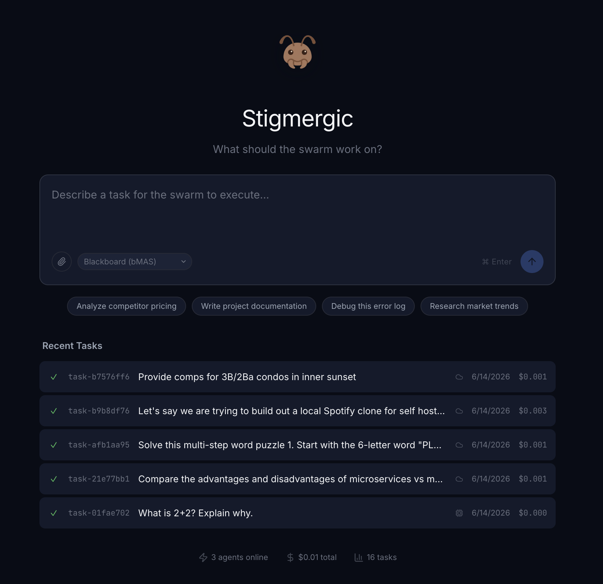

<p align="center">
  
</p>

<h1 align="center">Stigmergic</h1>

<p align="center">
  A self-hosted blackboard multi-agent system.
</p>

Stigmergic coordinates model-backed agents through a durable shared blackboard. The product uses the bMAS architecture.

This repository implements the **classic runtime only**. The classic runtime selects agents, records their contributions, and repeats until it selects a final answer.

## Start the classic stack

You need Docker 24 or newer, Docker Compose 2.20 or newer, and one provider API key.

```bash
git clone https://github.com/arvarik/bmas.git
cd bmas

./scripts/bmas init --provider gemini
./scripts/bmas up
./scripts/bmas smoke
```

The `init` command requests the provider key. It generates every local secret and creates `bmas.yaml` plus `.env`.

Select `anthropic` or `openai` if you use a different provider. Then open Mission Control at [http://localhost:9321](http://localhost:9321).

Read the [Quick Start](docs/QUICKSTART.md) if this is your first installation.

## What starts

The default stack runs on one host.

| Service | Purpose |
|:---|:---|
| Redis | Supplies locks, notifications, and live projections. |
| LiteLLM | Routes model requests through one API. |
| Starter agent | Executes classic roles through LiteLLM. It does not provide tools. |
| Daemon | Runs task lifecycles and saves durable state in SQLite. |
| Mission Control | Shows setup health, task lifecycles, files, logs, board entries, costs, and operator actions. |

The optional GPU profile adds local triage through vLLM. The normal starter does not need a GPU or a separate edge node.

## Classic task flow

1. The daemon classifies the task complexity.
2. The control unit selects one or more classic roles.
3. The agent executes each selected role.
4. The daemon saves each contribution on the blackboard.
5. The control unit repeats the cycle or selects the final answer.

Mission Control reads the durable event stream. It displays the same task state after a restart.

<p align="center">
  
</p>

## Common commands

| Command | Result |
|:---|:---|
| `./scripts/bmas init --provider gemini` | Creates a starter configuration and secure local secrets. |
| `./scripts/bmas up` | Builds the stack and waits for readiness. |
| `./scripts/bmas doctor` | Checks files, secrets, Compose, and live services. |
| `./scripts/bmas smoke` | Submits one task and waits for completion. |
| `./scripts/bmas dev` | Starts the development Compose override. |
| `./scripts/bmas test` | Runs the same checks as continuous integration. |
| `./scripts/bmas docs-check` | Checks documentation links. |

The `Makefile` provides matching targets, such as `make up` and `make test`.

## Documentation

Start with the guide that matches your work.

| Goal | Document |
|:---|:---|
| Install the starter | [Quick Start](docs/QUICKSTART.md) |
| Understand the services | [Concepts](docs/CONCEPTS.md) |
| Change models or runtime limits | [Configuration](docs/CONFIGURATION.md) |
| Deploy outside a local computer | [Deployment](docs/DEPLOYMENT.md) |
| Operate and recover the stack | [Operations](docs/OPERATIONS.md) |
| Change the source code | [Development](docs/DEVELOPMENT.md) |
| Add Hermes execution nodes | [Node Setup](docs/NODE_SETUP.md) |
| Read all documentation | [Documentation index](docs/README.md) |

## Repository layout

| Directory | Purpose |
|:---|:---|
| [`daemon/`](daemon/README.md) | Python orchestration API and durable task state. |
| [`agent/`](agent/README.md) | Starter execution API and optional Hermes adapter. |
| [`mission-control/`](mission-control/README.md) | Next.js operator interface. |
| [`litellm/`](litellm/README.md) | Model gateway configuration generator. |
| [`redis/`](redis/README.md) | Redis configuration. |
| [`triage/`](triage/README.md) | Optional local complexity classifier. |
| [`eval/`](eval/) | Classic runtime evaluation tools. |
| [`examples/`](examples/) | Supported starter and homelab configurations. |

## Research basis

The classic runtime follows the blackboard multi-agent system described by Han and Zhang in [Exploring Advanced LLM Multi-Agent Systems Based on Blackboard Architecture](https://arxiv.org/abs/2507.01701).

## License

This project uses the [GNU Affero General Public License v3.0](LICENSE).
