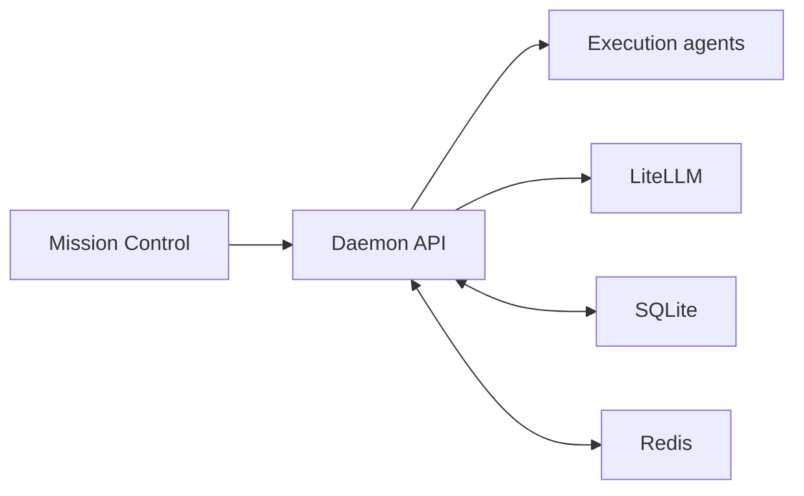

# Daemon

The daemon runs the classic task lifecycle and exposes the main Stigmergic API.

It saves authoritative task state in SQLite. It uses Redis for locks, notifications, and live projections.

## Responsibilities

1. Validate configuration and required secrets.
2. Accept and queue task submissions.
3. Classify task complexity.
4. Run classic control-unit rounds.
5. Dispatch role activations to agent endpoints.
6. Validate and save board entries.
7. Record usage, costs, logs, traces, files, and artifacts.
8. Publish durable task events.
9. Apply operator controls at safe lifecycle points.

## Service flow



## Source layout

| Path | Purpose |
|:---|:---|
| `src/app.py` | Creates FastAPI, shared clients, and background loops. |
| `src/config.py` | Loads validated runtime settings. |
| `src/config_schema.py` | Defines the typed `bmas.yaml` schema. |
| `src/database.py` | Owns SQLite task state and the durable event outbox. |
| `src/settings_store.py` | Stores supported live setting changes. |
| `src/core/orchestrator.py` | Runs task admission and classic execution. |
| `src/core/variants/classic.py` | Registers the public classic runtime contract. |
| `src/core/variants/traditional.py` | Contains the internal classic execution engine. |
| `src/core/blackboard.py` | Maintains Redis projections and controls. |
| `src/core/triage.py` | Classifies tasks through cloud or local triage. |
| `src/routes/` | Defines API route groups. |

The internal `traditional.py` name remains for saved-task compatibility. Public configuration uses `classic`.

## API groups

| Method and path | Purpose |
|:---|:---|
| `POST /submit` | Accepts a classic task and returns HTTP 202. |
| `GET /tasks` | Lists durable task history. |
| `GET /tasks/{id}` | Reads one task and its sub-tasks. |
| `GET /tasks/{id}/board` | Reads the durable board snapshot. |
| `GET /tasks/{id}/turns` | Reads role turns. |
| `GET /tasks/{id}/cost` | Reads model usage and cost data. |
| `GET /tasks/{id}/logs` | Reads structured logs. |
| `GET /tasks/{id}/trace` | Reads translated agent traces. |
| `GET /events/{id}` | Streams task events with replay support. |
| `GET /events/system` | Streams system task-lifecycle events. |
| `GET /capabilities` | Reports the classic runtime contract. |
| `GET /health` | Reports daemon and dependency health. |
| `GET /readiness` | Reports actionable full-stack readiness. |

File and artifact routes use `/tasks/{id}/files` and `/tasks/{id}/artifacts`.

Operator mutation routes support abort, pause, resume, directives, steering, and approvals.

Settings routes under `/settings` expose only the supported routing and role-registry changes.

## Authentication

| Key | Protected routes |
|:---|:---|
| `BMAS_API_KEY` | Task submission, operator controls, and settings mutations |
| `BMAS_NODE_KEY` | Agent log, trace, and artifact ingest |

Read-only health and task routes remain available to the trusted service network.

Mission Control keeps daemon keys in its server routes. Browser JavaScript does not receive these keys.

## Task admission

The daemon limits active tasks, queued tasks, objective size, endpoint concurrency, and endpoint wait time.

It also uses a circuit breaker for repeatedly failing agent endpoints. The `/health` response reports queue and endpoint state.

## Durable event delivery

The daemon writes the task record and event outbox entry in SQLite. It then publishes the event to Redis.

If Redis publication fails, the outbox keeps the pending event. A background loop retries it.

This order prevents a live event from describing task state that SQLite did not save.

## Health and readiness

`GET /health` always reports the current daemon state. A degraded dependency does not make the daemon process disappear.

`GET /readiness` checks Redis, SQLite, LiteLLM, execution agents, the classic runtime, and event delivery.

Container health requires the complete `/health` status to equal `healthy`.

## Configuration

The daemon reads `BMAS_CONFIG`, which defaults to `/etc/bmas/bmas.yaml` in Compose.

Docker Compose sets internal Redis, LiteLLM, and triage URLs. External service runs can set `BMAS_REDIS_URL`, `BMAS_LITELLM_URL`, and `BMAS_TRIAGE_URL`.

Read [Configuration](../docs/CONFIGURATION.md) for all source fields and environment limits.

## Development

Prepare the shared environment from the repository root.

```bash
./scripts/bmas setup-dev
```

Run the complete development stack:

```bash
./scripts/bmas dev
```

Run the daemon directly when Redis, LiteLLM, and an execution agent are already reachable:

```bash
BMAS_CONFIG=../bmas.yaml \
PYTHONPATH=src \
../.venv/bin/python -m uvicorn app:app --host 127.0.0.1 --port 9000 --reload
```

The shell must also provide the required secrets and internal service URLs.

## Tests

```bash
../.venv/bin/python -m pytest tests -q
../.venv/bin/python -m ruff check src tests
../.venv/bin/python -m mypy src --ignore-missing-imports
```

Run commands from the `daemon` directory so Ruff and mypy read `pyproject.toml`.

The complete repository command adds agent, evaluation, Mission Control, configuration, documentation, and Compose checks.

```bash
../scripts/bmas test
```
