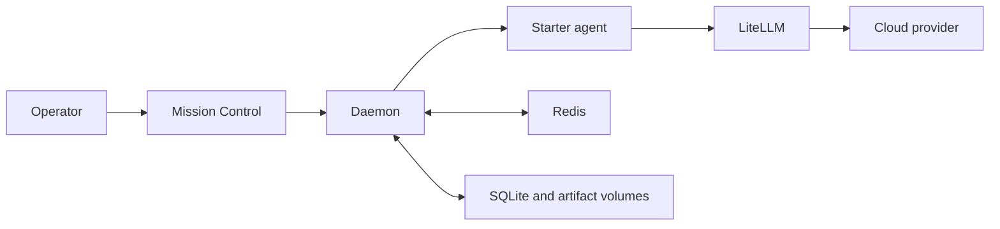

# Concepts

This document explains the current runtime and benchmark implementation.

## Product names

**Stigmergic** is the product name. **bMAS** is the blackboard multi-agent system architecture inside the product.

The repository implements **classic**, **patchboard**, and **stigmergic** runtimes. The old name `traditional` remains an input alias for Classic.

## Starter services

The single-host starter runs five required services.

| Service | Input | Output |
|:---|:---|:---|
| Mission Control | Operator actions and daemon events | Task requests and live views |
| Daemon | Tasks, configuration, and agent results | Task state, board entries, and events |
| Starter agent | One role activation | One model result plus usage data |
| LiteLLM | OpenAI-compatible model requests | Provider responses |
| Redis | Live projection updates and locks | Notifications and current projections |

SQLite owns durable task state. Redis supplies fast live state and coordination primitives.

## Classic runtime

The classic runtime uses a control unit and a shared blackboard.

1. Triage selects a complexity tier.
2. The control unit reads the current blackboard.
3. The control unit selects roles for the next round.
4. The daemon sends one activation to each selected role.
5. Each role returns a contribution or a decline result.
6. The daemon validates and saves the result.
7. The control unit starts another round or selects the final answer.

The task stops when it reaches a final answer, a runtime limit, a cost limit, or a failure state.

Mission Control shows five operator states: queued, running, blocked, failed, and completed. A blocked task needs an operator or a compatible runtime before it can continue.

## Patchboard runtime

Patchboard sends the same objective to independent contributor roles. It runs those calls concurrently, then sends all contributions to one integrator.

The runtime saves the contribution set before integration. Recovery does not repeat a saved contribution.

## Stigmergic workspace runtime

Stigmergic workspace sends one shared artifact through an ordered role sequence. Each role receives the latest artifact and returns one revision.

The runtime saves each completed revision. Recovery resumes from the next incomplete step.

## Benchmark records

A dataset version stores immutable normalized inputs. A test revision binds one dataset version to runtime arms and scorer versions.

A run creates one trial for each arm and dataset item. Attempts preserve retries, configuration snapshots, task links, costs, scores, and optional human reviews.

## Roles and nodes

A **role** defines the requested behavior. Examples include `planner`, `expert`, `critic`, and `decider`.

A **node** defines one execution API address. One node can execute several roles.

The starter sends every role to one tool-free node. An advanced deployment can route roles to separate Hermes nodes.

## Starter agent and Hermes agent

The starter agent sends one prompt to LiteLLM. It does not run shell commands, browse websites, or write workspace files.

A Hermes agent can use configured tools and a persistent workspace. It requires separate installation and security controls.

Start with the tool-free agent. Add Hermes only when a task needs a tool or an isolated execution environment.

## Durable state

The daemon writes these records to SQLite:

- task metadata and status
- role turns and board entries
- cost and usage records
- logs and translated traces
- a durable event outbox

Named Docker volumes store SQLite, Redis data, uploads, artifacts, and agent retry state.

The daemon can rebuild a live board projection after a restart. The event outbox retries notifications that fail during a temporary Redis problem.

## Readiness and health

The `/health` endpoint reports service state for monitoring tools. It returns HTTP 200 when the daemon runs, even if a dependency fails.

The `/readiness` endpoint reports whether the complete stack can accept a task. Each failed check includes one repair command.

Mission Control uses readiness to disable task submission until the stack can execute the request. The system status button in the top bar also shows provider credentials, storage access, queue capacity, and one real test-task action.

The Files workspace separates user Inputs from agent Outputs. It keeps every output version and supports side-by-side comparisons.

## Triage and routing

Triage selects `simple`, `light`, `medium`, or `complex`.

The `routing` section maps each tier to a LiteLLM alias. Triage does not select a physical agent node.

The role registry selects the agent node. Model routing and node routing are separate decisions.

## Advanced local inference

An advanced node can define an `inference` mapping. LiteLLM registers that server as an OpenAI-compatible local model.

The special routing value `local` selects these inference mappings. It does not select the starter agent.

The optional GPU profile starts a local triage model. It does not start a general task model.
