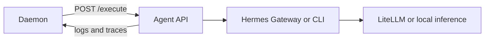

# Hermes Node Setup

This guide adds an advanced Hermes execution node to the classic runtime.

Do not use this guide for a first installation. The normal starter already includes a tool-free execution agent.

## Use a Hermes node when

Add a Hermes node when one or more tasks require these features:

- shell or file tools
- a persistent agent workspace
- node isolation
- role-specific capacity
- a separate local inference server

Hermes adds a larger security boundary. Review each enabled tool before you connect the node.

## Network flow



The daemon must reach the agent API port. The agent must reach LiteLLM and the daemon.

Use private addresses, a private tunnel, or a service network. Do not expose the agent API to the internet.

## Prerequisites

Prepare one Linux host with these items:

- Python 3.13
- the reviewed Hermes installation for your environment
- a working Hermes Runs API or `hermes` executable
- network access to the control plane
- a dedicated non-root service account

The repository does not install Hermes. Install the Hermes version that matches your gateway contract.

Read [Hermes API](HERMES_API.md) before you select the Runs API path.

## 1. Install the agent source

Place the `agent` directory from the same reviewed Stigmergic commit at `/opt/bmas-agent`.

Create a virtual environment and install the API dependencies.

```bash
cd /opt/bmas-agent
python3.13 -m venv .venv
.venv/bin/python -m pip install --upgrade pip
.venv/bin/python -m pip install -r requirements.txt
```

Install Hermes into the same environment, or set `HERMES_BIN` to its reviewed executable path.

## 2. Create a service account

```bash
sudo useradd --system --create-home --home-dir /var/lib/bmas-agent bmas-agent
sudo install -d -o bmas-agent -g bmas-agent /var/lib/bmas-agent/traces
sudo install -d -o bmas-agent -g bmas-agent /var/lib/bmas-agent/activations
```

Copy the required profiles to the service account.

```bash
sudo install -d -o bmas-agent -g bmas-agent /var/lib/bmas-agent/.hermes/profiles
sudo cp -R /opt/bmas-agent/profiles/. /var/lib/bmas-agent/.hermes/profiles/
sudo chown -R bmas-agent:bmas-agent /var/lib/bmas-agent/.hermes
```

Review each `SOUL.md` and `config.yaml` before startup. Remove tools that the role does not need.

## 3. Create the environment file

Create `/etc/bmas/agent.env` with root ownership and mode `0640`.

```env
BMAS_EXECUTION_BACKEND=hermes
NODE_ID=hermes-node-1
LITELLM_URL=http://192.168.1.10:4000/v1
LITELLM_MODEL=starter-model
LITELLM_API_KEY=replace-with-litellm-master-key
DAEMON_INGEST_URL=http://192.168.1.10:9000
BMAS_NODE_KEY=replace-with-control-plane-node-key
BMAS_EXECUTE_KEY=replace-with-control-plane-execute-key
TRACE_SPOOL_DIR=/var/lib/bmas-agent/traces
ACTIVATION_CACHE_DIR=/var/lib/bmas-agent/activations
```

Add one Hermes execution method.

For the Runs API:

```env
HERMES_GATEWAY_URL=http://127.0.0.1:8642
HERMES_GATEWAY_KEY=replace-with-gateway-key
```

For the CLI fallback:

```env
HERMES_BIN=/path/to/hermes
```

The Runs API supports structured run state and event streaming. The CLI fallback executes one process for each activation.

Protect the environment file.

```bash
sudo chown root:bmas-agent /etc/bmas/agent.env
sudo chmod 0640 /etc/bmas/agent.env
```

## 4. Create the system service

Create `/etc/systemd/system/bmas-agent.service`.

```ini
[Unit]
Description=Stigmergic Hermes execution agent
After=network-online.target
Wants=network-online.target

[Service]
Type=simple
User=bmas-agent
Group=bmas-agent
WorkingDirectory=/opt/bmas-agent
Environment=HOME=/var/lib/bmas-agent
EnvironmentFile=/etc/bmas/agent.env
ExecStart=/opt/bmas-agent/.venv/bin/uvicorn api_server:app --host 0.0.0.0 --port 8000
Restart=on-failure
RestartSec=10
NoNewPrivileges=true
PrivateTmp=true

[Install]
WantedBy=multi-user.target
```

Start the service.

```bash
sudo systemctl daemon-reload
sudo systemctl enable --now bmas-agent
sudo systemctl status bmas-agent
```

## 5. Verify the node

Run these checks on the node:

```bash
curl -fsS http://127.0.0.1:8000/health
sudo journalctl -u bmas-agent -n 100 --no-pager
```

The health response must show `status: healthy`. It must show `hermes-runs-api` or `hermes-cli` as the execution backend.

Check the agent from the control-plane host:

```bash
curl -fsS http://192.168.1.21:8000/health
```

If this request fails, correct the node firewall or route before you change `bmas.yaml`.

## 6. Register the node

Add the agent API address under `nodes`.

```yaml
nodes:
  - name: hermes-node-1
    host: 192.168.1.21
    port: 8000
    role: hermes
```

Pin roles when a specific node must execute them.

```yaml
coordination:
  role_registry:
    planner:
      preferred_host: 192.168.1.21
      profile: planner
      dispatch_port: 8000
```

Set `preferred_host: null` to load balance across all configured node hosts.

The starter Compose agent uses the Docker host name `agent`. Remove that node entry when the control-plane daemon cannot resolve or reach it.

## 7. Apply the control-plane change

```bash
python3 scripts/validate_configs.py
docker compose up -d --build litellm daemon dashboard
./scripts/bmas doctor --wait 180
./scripts/bmas smoke
```

The validator rejects a `preferred_host` that does not match a node host.

## Optional local inference

An agent node and an inference server are separate services. They can run on the same host or different hosts.

Register an OpenAI-compatible inference server under the node:

```yaml
nodes:
  - name: hermes-node-1
    host: 192.168.1.21
    port: 8000
    role: hermes
    inference:
      host: 192.168.1.31
      port: 8080
      model: local-model
      max_tokens: 8192
```

Set a routing tier to `local` only after LiteLLM can reach that inference address.

## Failure checks

### The agent health endpoint reports no execution backend

1. Hermes did not provide a reachable Runs API or executable.
2. `HERMES_GATEWAY_URL` is wrong, or `HERMES_BIN` does not exist.
3. Correct one execution method and restart `bmas-agent`.

### The daemon cannot dispatch

1. The task reports an agent connection failure.
2. The daemon cannot reach `nodes[].host` and `dispatch_port`.
3. Test the health URL from the daemon network, then correct routing or firewall rules.

### Logs or traces do not arrive

1. The agent completes work but Mission Control lacks agent detail.
2. `DAEMON_INGEST_URL` is unreachable, or `BMAS_NODE_KEY` differs.
3. Compare the control-plane key and node environment, then restart the agent.

### Execution requests return HTTP 401

1. The daemon reaches the node but the node rejects execution.
2. `BMAS_EXECUTE_KEY` differs between the control plane and the node.
3. Set the same generated value on both services and restart them.
