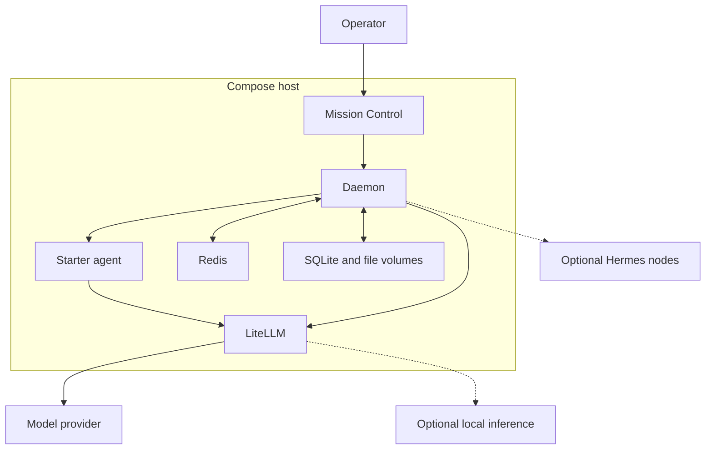
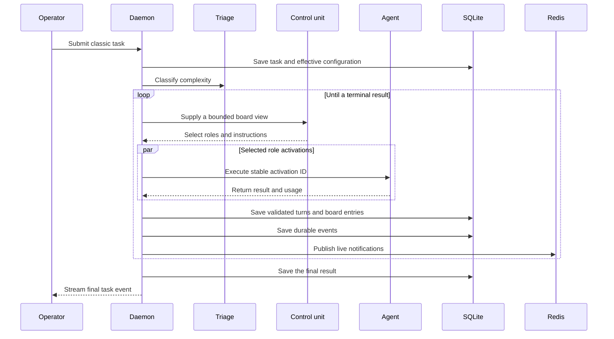
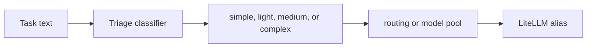

# System Architecture

[Return to the documentation index](../README.md).

This document describes the current classic runtime. Stigmergic has no second coordination runtime in this repository.

## System boundaries

The starter keeps each required service on one Docker network. It publishes ports on `127.0.0.1` by default.

## Component ownership

| Component | Owns | Does not own |
|:---|:---|:---|
| Mission Control | Operator views and browser interaction | Durable task state |
| Daemon | Task lifecycle, classic rounds, task state, and events | Provider transport and agent tools |
| Execution agent | One role activation and activation retry state | Task scheduling and board authority |
| LiteLLM | Provider routing and provider API normalization | Classic role selection |
| SQLite | Durable task, board, event, cost, log, and artifact metadata | Low-latency notifications |
| Redis | Locks, notifications, controls, and live projections | The only durable task copy |

## Classic task lifecycle

The control unit can select the planner, generated experts, critic, conflict resolver, cleaner, and decider.

The runtime stops on a final answer, a failure, an operator abort, a duration limit, a round limit, a stall limit, or a budget ceiling.

## Effective configuration

The daemon captures the effective runtime configuration when it accepts a task. This snapshot includes these values:

- the canonical runtime and contract version
- classic settings and board view limits
- model routing and model pools
- role registry and agent endpoints
- model pricing
- local inference aliases

A restart reads this saved configuration. A later live setting change does not change an existing task.

## Triage and model routing

Triage selects one tier. The routing table selects a LiteLLM alias for that tier.

Cloud triage sends a short request through one configured model alias. Local triage sends a constrained request to the optional vLLM service.

Model routing does not select a physical agent node. The role registry performs that selection.

## Role and node routing

Each classic role has a profile, dispatch port, enabled flag, and optional preferred host.

The daemon builds one endpoint list for each role. It places the preferred host first and adds remaining node hosts as fallbacks.

The default starter gives all roles the same Docker agent endpoint. An advanced deployment can pin a role to a Hermes node.

## Activation reliability

The daemon assigns a stable activation identifier before it calls an agent.

The agent writes a running activation record before external execution. It saves the remote Hermes run identifier when one exists.

A daemon retry follows these rules:

1. Return a saved terminal response when it exists.
2. Reconnect to a known active Hermes run.
3. Refuse an uncertain duplicate when no run identifier exists.
4. Keep cancellation terminal.

The direct LiteLLM backend uses the same activation record. This behavior prevents a saved provider response from running twice.

## Board data

A board entry contains identity, type, author, title, body, references, confidence, status, and round data.

The daemon validates entry size and allowed fields before it commits the entry.

The cleaner can condense a large board. The daemon still retains durable events and task history in SQLite.

The control unit receives a bounded board view. The view budget prevents unbounded prompt growth during a long task.

## Durable writes and live events

SQLite owns the durable event journal and outbox.

For each state change, the daemon follows this order:

1. Start the SQLite transaction.
2. Save the state change.
3. Save the durable event and outbox record.
4. Commit the transaction.
5. Publish the event through Redis.
6. Mark the outbox delivery complete.

If step 5 fails, the background delivery loop retries the outbox record.

Each event has a monotonic cursor and an idempotency key. Mission Control ignores duplicate or older cursors.

## Event stream recovery

Task and system streams use Server-Sent Events.

A reconnect sends the last received cursor through `Last-Event-ID`. The daemon replays later events from SQLite.

If the requested cursor falls outside retained history, the daemon returns HTTP 409. Mission Control hydrates the current task state and reconnects.

This recovery path keeps the browser view correct after a tab sleep, network interruption, or service restart.

## Storage

The Compose stack mounts these durable paths:

| Path | Named volume | Purpose |
|:---|:---|:---|
| `/data` | `daemon-data` | SQLite database |
| `/data/uploads` | `uploads-data` | User uploads |
| `/data/output` | `artifacts-data` | Task artifacts |
| `/data` in Redis | `redis-data` | Redis persistence |
| `/var/lib/bmas-agent` | `agent-data` | Activation cache and trace retry state |

The backup command archives the daemon data path and its nested upload plus artifact mounts.

## Health model

`GET /health` reports component state, task queue state, endpoint circuits, lifecycle data, and event delivery pressure.

`GET /readiness` converts required checks into an actionable operator document.

The required checks are Redis, SQLite, LiteLLM, configured agent endpoints, the classic runtime, and event delivery.

Mission Control disables submission when readiness fails.

## Authentication boundaries

| Boundary | Key |
|:---|:---|
| Browser to Mission Control | `BMAS_DASHBOARD_KEY` |
| Mission Control or API client to daemon mutations | `BMAS_API_KEY` |
| Daemon to execution agent | `BMAS_EXECUTE_KEY` |
| Execution agent to daemon ingest | `BMAS_NODE_KEY` |
| Daemon and agent to LiteLLM | `LITELLM_MASTER_KEY` |

The default published address is loopback. An internet deployment exposes only Mission Control through a TLS reverse proxy.

## Load boundaries

The daemon applies explicit limits to these resources:

- active and queued tasks
- task objective characters
- active requests for each agent endpoint
- agent endpoint wait time
- circuit breaker failures and recovery time
- event size and outbox length
- replay page size
- in-memory board projections

The `/health` endpoint reports pressure at each runtime boundary.

## Optional local inference

A node can register an OpenAI-compatible inference server. LiteLLM creates a direct alias and a shared `edge-local` group.

Routing to `local` uses the shared group. It does not start or install the inference server.

The optional triage container uses `vllm/vllm-openai:v0.27.1`. The normal cloud starter does not start this container.

## Source map

| Area | Main source |
|:---|:---|
| FastAPI lifecycle | `daemon/src/app.py` |
| Typed configuration | `daemon/src/config_schema.py` |
| Classic adapter | `daemon/src/core/variants/classic.py` |
| Classic engine | `daemon/src/core/variants/traditional.py` |
| Task orchestration | `daemon/src/core/orchestrator.py` |
| SQLite state | `daemon/src/database.py` |
| Redis projections | `daemon/src/core/blackboard.py` |
| Execution API | `agent/api_server.py` |
| Model configuration generator | `litellm/generate_config.py` |
| Mission Control task stream | `mission-control/src/hooks/useTaskStream.ts` |
| Mission Control runtime adapter | `mission-control/src/lib/variants.ts` |

## Core guarantees

- The daemon saves durable state before it publishes a live event.
- A task uses one captured effective configuration.
- An activation retry uses one stable activation identifier.
- An unknown runtime never changes silently to classic.
- A failed dependency makes readiness fail.
- A public example must pass strict validation without warnings.
- A normal Compose rebuild uses fixed base-image versions.
