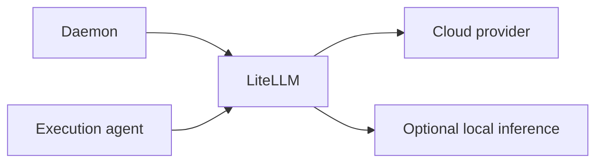

# LiteLLM Gateway

LiteLLM gives the daemon and execution agent one OpenAI-compatible model API.

The container generates its LiteLLM configuration from `bmas.yaml` during startup.

## Request flow



The daemon selects an alias from `routing` or `model_pools`. The agent receives that selected alias with each activation.

## Generated model entries

The generator creates these entries:

- One entry for each key under `models`.
- One `edge-node-N` entry for each node with an `inference` mapping.
- One shared `edge-local` group for load balancing across local inference servers.
- One local triage entry when `triage.backend` equals `local`.

The special routing value `local` maps to `edge-local`.

## Files

| File | Purpose |
|:---|:---|
| `Dockerfile` | Extends the fixed LiteLLM image version. |
| `generate_config.py` | Converts `bmas.yaml` to LiteLLM configuration. |
| `entrypoint.sh` | Generates the file and starts the proxy. |

## Router defaults

| Setting | Value |
|:---|:---|
| Routing strategy | `simple-shuffle` |
| Model request retries | `2` |
| Model request timeout | `120` seconds |
| Unsupported parameters | Dropped |
| Authentication | `LITELLM_MASTER_KEY` |

## Operations

```bash
docker compose up -d --build litellm
docker compose logs --tail 100 litellm
curl -fsS http://127.0.0.1:4000/health/readiness
```

Run `./scripts/bmas smoke` to test a complete authenticated model route.

## Provider variables

The Compose service passes `GEMINI_API_KEY`, `ANTHROPIC_API_KEY`, and `OPENAI_API_KEY` when those values exist.

Each `models.*.api_key_env` value must name the matching variable.

Custom providers can use `models.*.api_base` when they expose an OpenAI-compatible API.

## Configuration changes

Rebuild LiteLLM after a model, routing, triage, or inference-node change.

```bash
python3 scripts/validate_configs.py
docker compose up -d --build litellm daemon agent
./scripts/bmas doctor --wait 180
```

Read [Configuration](../docs/CONFIGURATION.md) for the supported source fields.
