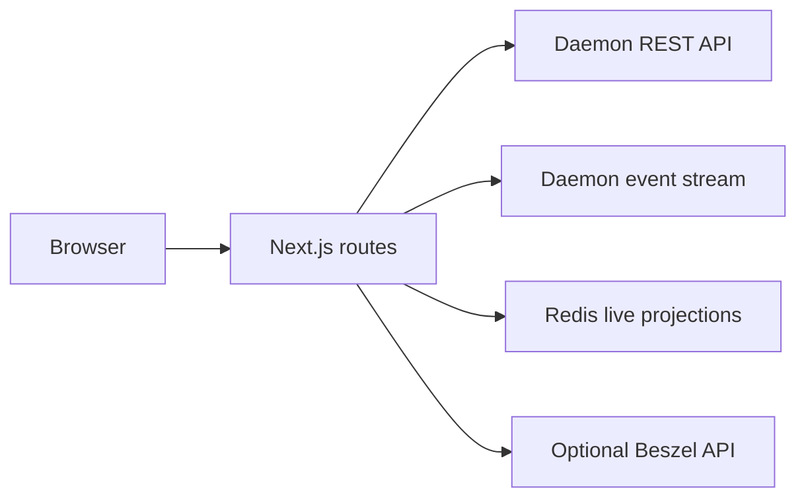

# Mission Control

Mission Control is the Next.js operator interface for the classic runtime.

The default Compose stack publishes it at [http://localhost:9321](http://localhost:9321).

## Main views

| View | Data |
|:---|:---|
| Landing page | Readiness, task submission, recent tasks, and summary counts |
| Task overview | Status, phase, process summary, and final result |
| Execution graph | Classic rounds, role turns, and control-unit narration |
| Logs | Daemon logs and agent traces |
| Blackboard | Durable board entries, references, and debate threads |
| Mission | Live board, role activity, events, and convergence |
| Hermes sessions | Profile-aware session browsing, messages, and forks |
| Skills | Read-only active skills and toolsets for each Hermes node profile |
| Task header | Uploaded files, extracted-text previews, and original downloads |
| Artifacts | Agent-created task outputs and immutable version downloads |
| Infrastructure | Agent health and optional Beszel telemetry |

The interface exposes only the classic runtime. A single available runtime appears as a fixed status label.

## Readiness

The landing page requests `/api/readiness`. This route proxies the daemon `/readiness` endpoint.

Mission Control disables task submission until each required service passes its check. A failed check shows the daemon repair command.

## Data flow



Server routes keep daemon and Redis credentials out of browser JavaScript.

The task stream hydrates saved REST data before it applies live events. It reconnects with an event cursor after a temporary interruption.

## Access control

Set `BMAS_DASHBOARD_KEY` to protect every page and proxy route. The starter command creates this value.

The browser uses HTTP Basic authentication. Enter any username and the dashboard key as the password.

The `/api/health` route stays public for container and load-balancer checks. It returns only a fixed status value.

Use HTTPS whenever a browser connects outside the local computer. HTTP Basic sends a reusable credential with each request.

Mission Control sends `BMAS_API_KEY` only from server routes to daemon mutation routes.

Mission Control sends `BMAS_EXECUTE_KEY` only from server routes to agent inventory and session proxies.

Mission Control stores initial attachments before it admits a task to the execution queue. A rejected attachment prevents the task from starting.

## Server environment

| Variable | Purpose |
|:---|:---|
| `BMAS_DAEMON_URL` | Selects the internal daemon base URL. |
| `BMAS_REDIS_URL` | Selects the internal Redis URL. |
| `REDIS_PASSWORD` | Supports a generated Redis URL outside Compose. |
| `BMAS_API_KEY` | Authenticates daemon mutations. |
| `BMAS_EXECUTE_KEY` | Authenticates agent capability, inventory, and session requests. |
| `BMAS_DASHBOARD_KEY` | Protects browser and proxy access. |
| `BESZEL_EMAIL` | Authenticates optional Beszel requests. |
| `BESZEL_PASSWORD` | Authenticates optional Beszel requests. |
| `ALLOWED_DEV_ORIGINS` | Allows named LAN origins during Next.js development. |

Docker Compose sets the internal URLs. Do not put them in a normal starter `.env`.

Docker Compose mounts `bmas.yaml` at `/etc/bmas/bmas.yaml`. Mission Control reads this fixed path.

## API route groups

| Route group | Purpose |
|:---|:---|
| `/api/health` | Returns a public, fixed process health result. |
| `/api/readiness` | Proxies actionable stack readiness. |
| `/api/capabilities` | Proxies the daemon runtime contract. |
| `/api/submit` | Submits a classic task. |
| `/api/tasks/*` | Reads task state, board data, files, artifacts, costs, logs, and traces. |
| `/api/stream/*` | Proxies task and system event streams. |
| `/api/hitl` | Sends pause, resume, abort, and operator directives. |
| `/api/profiles` | Lists the active Hermes profile for each configured agent. |
| `/api/skills` | Reads the active profile's Hermes skills. |
| `/api/toolsets` | Reads enabled and configured Hermes toolsets. |
| `/api/sessions/*` | Lists, reads, and forks Hermes sessions. |
| `/api/settings/*` | Reads and changes supported runtime settings. |
| `/api/telemetry` | Proxies optional Beszel telemetry. |

Each daemon response crosses a server route before a client component uses it.

## Technology

| Part | Version |
|:---|:---|
| Next.js App Router | 16.3.1 |
| React | 19.2.7 |
| TypeScript | 6.x |
| Vitest | 4.1.x |

The production Dockerfile uses Node.js 22.23.2 on Alpine 3.23.

## Development

Prepare the repository environment first.

```bash
../scripts/bmas setup-dev
```

Run Mission Control through the complete development stack:

```bash
../scripts/bmas dev
```

Run component checks directly:

```bash
npm run lint
npx tsc --noEmit
npm run test:run
npm run build
```

Use `npm ci` when the lockfile changes or the dependency directory is absent.

## Design rules

The design tokens live in `src/app/globals.css`. View-specific styles live in `src/app/views.css`.

Use server components by default. Add `"use client"` only for state, effects, or browser APIs.

Each data view must show loading, empty, active, error, and unavailable states when those states apply.

Read the [Design System](../docs/design/DESIGN.md) before you add a reusable visual pattern.

## Tests

Route tests mock the daemon boundary. Contract tests reject malformed capability, event, and readiness responses.

The complete repository test command also runs a production Next.js build.

```bash
../scripts/bmas test
```
